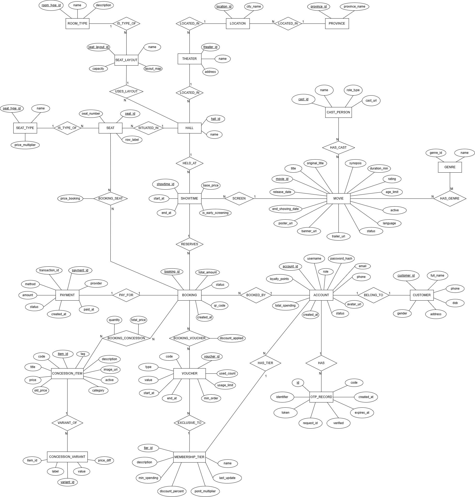
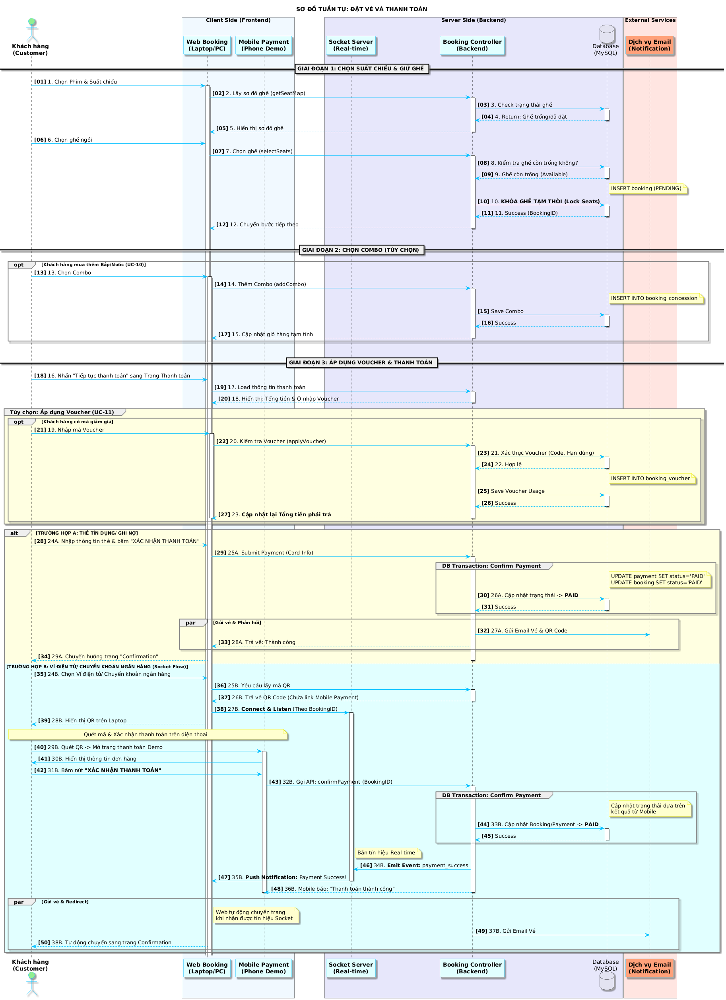

# 🎬 DCINE - Movie Ticket Booking Web System

> **Đồ án Môn học: Nhập môn Công nghệ phần mềm - PTIT HCM**
>
> **Nhóm thực hiện:** Nhóm 17  
> **Phiên bản:** 1.0.0

---

## Giới thiệu

**DCINE Web** là hệ thống web giúp khách hàng:
- Tìm kiếm và xem thông tin phim đang chiếu & sắp chiếu.
- Đặt vé trực tuyến với sơ đồ ghế tương tác theo thời gian thực.
- Thanh toán nhanh chóng qua ví điện tử (MoMo, VNPay, ZaloPay) hoặc thẻ.
- Nhận vé điện tử có mã QR để soát vé tại rạp.
### 🌟 Điểm nổi bật
* **Real-time Seat Locking:** Sử dụng **Redis** để giữ ghế tạm thời, ngăn chặn tình trạng hai khách hàng đặt cùng một ghế (Concurrency Handling).
* **Real-time Payment:** Tích hợp **Socket.IO** để cập nhật trạng thái thanh toán ngay lập tức từ thiết bị di động lên trình duyệt web.
* **Dynamic Pricing:** Tính giá vé động theo loại ghế, thời gian, combo và voucher khuyến mãi.

---

## 📂 Tài liệu & Báo cáo (Attachments)

Dưới đây là các tài liệu chi tiết về thiết kế và triển khai của đồ án:

| Tài liệu | Link tải / Xem |
| :--- | :--- |
| **Báo cáo đồ án (Full)** | [Tải về Báo cáo PDF](./docs/NHOM_17_DCINE_Report.pdf) |
| **Slide thuyết trình** | [Xem Slide PowerPoint](./docs/NHOM_17_Slide.pdf) |
| **Thiết kế Database (ERD)** | [Xem sơ đồ ERD](./docs/diagrams/ERD/dcine_erd.drawio.png) |
| **Sơ đồ Use Case tổng quát** | [Xem sơ đồ Use Case](./docs/diagrams/UseCase_digrams/UseCase_Overview.drawio.png) |
| **Sơ đồ tuần tự đặt vé và thanh toán(Sequence)** | [Xem thư mục Sequence Diagrams](./docs/diagrams/Sequence_digrams/Booking_Ticket_Sequence_Diagram.png) |

## 🛠️ Kiến trúc & Công nghệ

Hệ thống được xây dựng dựa trên các công nghệ hiện đại và ổn định:

| Thành phần | Công nghệ sử dụng | Chi tiết |
| :--- | :--- | :--- |
| **Frontend** | **HTML5, CSS3, JavaScript (ES6+)** | Giao diện thuần, không sử dụng Framework nặng, tối ưu tốc độ tải. Sử dụng `Socket.io-client` để nhận thông báo real-time. |
| **Backend** | **Java 21, Spring Boot 3.4.10** | Xây dựng RESTful API, xử lý logic nghiệp vụ phức tạp. |
| **Database** | **MySQL 8.0** | Lưu trữ dữ liệu quan hệ (Phim, Rạp, Vé, User). |
| **Caching** | **Redis** | Lưu trữ trạng thái ghế tạm thời (TTL Seat Holding). |
| **Real-time** | **Socket.IO (Netty)** | Xử lý luồng thanh toán thời gian thực. |
| **Security** | **Spring Security + HttpSession** | Xác thực và phân quyền người dùng dựa trên Session. |

---

## 📸 Sơ đồ Hệ thống

### 1. Sơ đồ Quan hệ thực thể (ERD)
*(Mô tả cấu trúc dữ liệu của hệ thống bao gồm các bảng Account, Movie, Showtime, Booking, Seat...)*



### 2. Sơ đồ Tuần tự: Quy trình Đặt vé & Thanh toán
*(Mô tả luồng tương tác giữa User -> Controller -> Service -> Redis/DB)*



---

## 🚀 Hướng dẫn Cài đặt & Chạy dự án

### Yêu cầu hệ thống (Prerequisites)
* **Java JDK 21** trở lên.
* **Maven** 3.8+.
* **MySQL** Server.
* **Redis** Server (Bắt buộc cho tính năng giữ ghế).

### Bước 1: Cấu hình Database
1.  Tạo database MySQL tên `dcine_db`.
2.  Import file cấu trúc và dữ liệu mẫu:
    * `backend/database/dcine_schema.sql`
    * `backend/database/dcine_data.sql`
3.  Cập nhật file `application.properties` trong Backend:
    ```properties
    spring.datasource.url=jdbc:mysql://localhost:3306/dcine_db
    spring.datasource.username=root
    spring.datasource.password=YOUR_PASSWORD
    spring.data.redis.host=localhost
    spring.data.redis.port=6379
    ```

### Bước 2: Cấu hình địa chỉ IP LAN (Quan trọng ⚠️)
Để điện thoại có thể truy cập được trang thanh toán, bạn cần đổi `localhost` thành địa chỉ **IP mạng LAN** của máy tính (Ví dụ: `192.168.1.10`):

1.  **Backend:** Mở file `src/main/java/com/example/cinema/service/CheckoutService.java`.
    * Tìm dòng: `String IP = "10.45.69.10";`
    * Sửa thành IP LAN hiện tại của máy bạn.
2.  **Frontend:** Mở file `mobile-pay.html` (hoặc `payment-realtime.js`).
    * Tìm các đoạn code kết nối Socket/API đang để `localhost`.
    * Đổi thành IP LAN tương ứng để điện thoại có thể kết nối.
    
### Bước 3: Chạy Backend (Spring Boot)
Di chuyển vào thư mục backend và chạy lệnh:
```bash
cd backend
mvn spring-boot:run